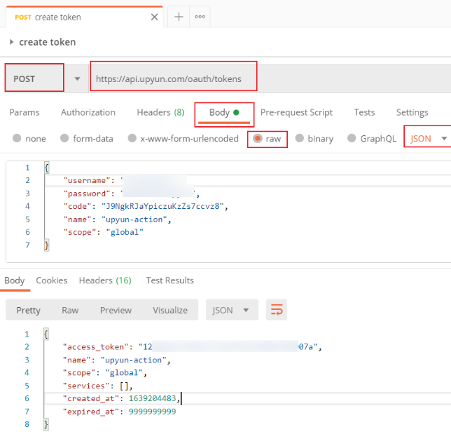

<h1 align="center">upyun-action</h1>

> ☁️ upyun | 又拍云 | GitHub Actions

[]()
[](https://github.com/yiyungent/upyun-action/blob/master/LICENSE)


## 介绍

upyun | 非官方 | 又拍云 for GitHub Actions

## 功能

- [x] 批量刷新缓存
  - 利用 GitHub Actions 在更新博文等 后 立即刷新缓存

## 使用

### 1. 获取又拍云 token

- [创建 又拍云 token](https://api.upyun.com/doc#/api/operation/oauth/POST%20%2Foauth%2Ftokens)



> `access_token` 即为又拍云 token

### 2. 创建 upyun-refresh.yml

> .github/workflows/upyun-refresh.yml

```yml
name: upyun refresh

on:
  push:
    branches: [main] # 注意更改为你的 branch, 例如 master

jobs:
  build:
    runs-on: ubuntu-latest
    steps:
      - name: Upyun Refresh
        uses: yiyungent/upyun-action@main
        with:
          # 在 Settings->Secrets 配置 UPYUN_TOKEN
          upyun_token: ${{ secrets.UPYUN_TOKEN }}
          # 要刷新的url, 支持匹配符 *, 多个url中间用 \n 隔开
          refresh_cache_urls: "https://moeci.com/posts/*\nhttps://moeci.com/about"

```


## Donate

upyun-action is an MIT licensed open source project and completely free to use. However, the amount of effort needed to maintain and develop new features for the project is not sustainable without proper financial backing.

We accept donations through these channels:
- <a href="https://afdian.net/@yiyun" target="_blank">爱发电</a>

## Author

**upyun-action** © [yiyun](https://github.com/yiyungent), Released under the [MIT](./LICENSE) License.<br>
Authored and maintained by yiyun with help from contributors ([list](https://github.com/yiyungent/upyun-action/contributors)).

> GitHub [@yiyungent](https://github.com/yiyungent) Gitee [@yiyungent](https://gitee.com/yiyungent)


